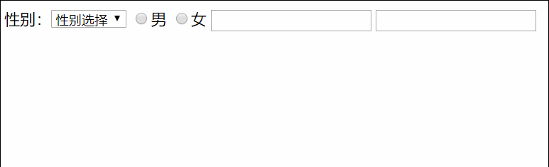

## 模块、控制器、视图模型，双向数据绑定模型 ##

	<body>
	    

	        <h2 ng-bind="name"></h2>
	        <input type="text" ng-model="name"> <!-- 双向数据绑定  -->
	       
	    

	</body>
	
模块  

	ng-app="hd"

控制器 

	ng-controller="ctrl"

双向绑定  

model Server 从服务端拿到数据，然后把数据交给$scope（ViewModel）  
$scope 是由controller管理，$scope把数据分配给视图view  
如果视图view发生变化，同样影响到viewmodel，即MVVM双向绑定 

## 声明模块与控制器规范与依赖注入 ##
html

	<body ng-app="hd">
		

			{{name}}
		

	</body>

js 

	

为什么要向上面这样写呢？其实下面这种写法也是可以的，但是当使用js打包工具时，形参$scope会被压缩成a等单字母，而Angular容器依赖$scope注入，变成单字母后angular就不认识了。  
因此上使用依赖注入的形式，先[],然后在里面写上依赖$scope

	m.controller('ctrl',function($scope){
		$scope.name="模块";
	});

## $scope的基本用法 ##
html 

	<body ng-app="hd">
		

			商品名称 {{goods.data.title}}
			价格 {{goods.data.price}}
			购买数量 {{goods.data.num}}
			总计 {{goods.data.price*goods.data.num}}
			<button ng-click="goods.add">增加</button>
			<button ng-click="goods.reduce">减少</button>
			<button ng-click="fun()">触发函数</btuuon>
		

	</body>

js

	

- 可以看到，{{name}}和ng-bind="name"都能显示$scope下的name,那么什么时候用表达式，什么时候用指令呢 ？  
- 表达式后面可以随意添加字符串，指令里面添加字符串比较繁琐一些，  
- 当网络延迟或者js文件按需加载时，表达式可能会出现没来得及加载的情况，花括号会闪烁一下，这时用指令好一些  
- 也可以使用ng-cloak解决表达式中花括号闪烁的问题  
- 如果js按需加载，当执行到body时，由于css的关系，body隐藏，然后引入angular文件  
- angular会解析ng-cloak指令，解析之后，再显示

## ng-model在表单中的双向绑定 ##
html  

	<body ng-app="hd">
	    

	        <form action="">
	            <input type="text" name="title" ng-model="name">
	            {{name}}
	            <input type="submit">
	        </form>
	    

	</body>

js

	

通过ng-model指令双向绑定

## ng-value的使用 ##

html 

	<body ng-app="hd">
	    

	        商品： <input type="text" ng-model="goods.title"> 
	        价格：<input type="text" ng-model="goods.price" readonly> 
	        数量：<input type="text" ng-model="goods.num"> 
	        总价：<input type="text" ng-value="goods.price*goods.num" readonly>
	     
	    

	</body>

js  

	

ng-value可以直接读取到scope中的值 

## angular控制单选框 ##

html  

	<body ng-app="hd">
	    

	        网站开启
	        <input type="radio" ng-model="status" ng-value="1">开启
	        <input type="radio" ng-model="status" ng-value="0">关闭
	        {{status}}
	        

	            <h2>关闭原因</h2>
	            <textarea name="" id="" cols="30" rows="10">正在维护中</textarea>
	        

	    

	</body>

js 

	

打开页面时，默认状态为1，即开启  

当选择关闭时，因为双向绑定，$scope.status=0  

ng-show即显示 

## angular控制复选框 ##

html

	<body ng-app="hd">
	    

	        游戏：<input type="checkbox" ng-model="data.game" ng-true-value="1" ng-false-value="0">
	        电影：<input type="checkbox" ng-model="data.video" ng-true-value="1" ng-false-value="0">
	
	        

	            <h1>游戏</h1>
	            <textarea name="" id="" cols="30" rows="10"></textarea>
	        

	        

	            <textarea name="" cols="30" rows="10"></textarea>
	        

	        {{data}}
	    

	</body>

js  

	

ng-model指令双向绑定   
ng-true-value=1 勾选时值为1 
ng-false-vlue=0  取消勾选时值为0

## angular操作下拉列表框 ##

html 

	<body ng-app="hd">
	    

	        <select name="" ng-options="v.value as v.name for v in data" ng-model="city" id="">
	            <option value="">请选择城市</option>
	        </select>
	        {{city}}
	    

	</body>

js  

	

## 函数使用方法之大小写和对象深拷贝 ##

	<body ng-app="hd" ng-controller="ctrl">
	
	</body>
	

## 函数使用对象扩充与数据遍历 ##

	<body ng-app="hd" ng-controller="ctrl">
	{{data}}
	{{data1}}
	</body>
	

## json数据转换与本地存储及$scope数据序列化提交后台 ##

	<body ng-app="hd" ng-controller="ctrl">
	
	</body>
	

数据提交后台 

html 

	<body ng-app="hd" ng-controller="ctrl">
	<form action="" method="post">
	    标题：<input type="text" ng-model="field.title">
	    点击量：<input type="text" ng-model="field.click">
	    内容: <input type="text" ng-model="field.content">
	    <textarea name="data" id="" cols="30" rows="10"></textarea>
	    <input type="submit" value="提交">
	</form>
	</body>

js

	

## 数据类型判断函数与数据比较方法的使用 ##

	<body ng-app="hd" ng-controller="ctrl">
	
	</body>
	

## ng-init与ng-trim ##

html 

	<body ng-app="hd">
	

	    <form action="">
	        标题：<input type="text" name="title" ng-trim ng-model="title"> 
	        <input type="text" name="data"> 
	        <input type="submit">
	    </form>
	    {{title}}
	

	</body>

js  

	

- ng-init 是某个的初始值
- 当使用ng-model双向绑定时，$scope.title会因为ng-model定执行了ng-trim而去掉多余空格
- 所以name=data的这个输入框中是没有空格的 
- 而name=title的这个输入框里面还是有空格的
- 但是，如果input框的类型是password，则自动保留空格
- 其他输入框想继续保留空格，可以设置ng-trim=false

## ng-if,ng-show,ng-disabled ##

html 

	<body ng-app="hd">
	    

	        <input type="checkbox" ng-model="name">显示
	        <input type="checkbox" ng-model="status">接受协议
	        <button ng-init="copyright=false" ng-click="copyright=!copyright">查看协议</button>
	         
	        <textarea name="" ng-show="copyright" id="" cols="30" rows="10"></textarea>
	         
	        <button ng-disabled="!status">登录</button>
	        
hhhhh

	        {{name}}
	        
hhhhh

	    

	
	</body>

js 

	

ng-if和ng-show的区别
- 虽然两个指令都是控制元素显示，但是ng-if直接remove了这个元素，而ng-show只是设置了它display="none "
- ng-show还有ng-hide为不显示 

## ng-repeat ##

html 

	

	        <!--$first为第一个 $last为最后一个 $middle为中间的 $even为偶数行 $odd 为奇数行-->
	        <li ng-repeat="(k,v) in data" style="{{$odd ? 'color:red;' : 'color:blue'}}">
	            名称：{{v.name}}  网址：{{v.url}}
	        </li>
	        <li ng-repeat="(k,v) in data">
	            
	                名称：{{v.name}}  网址：{{v.url}}
	            
	            
	                名称：{{v.name}}  网址：{{v.url}}
	            
	            
	                名称：{{v.name}}  网址：{{v.url}}
	            
	        </li>
	        <li ng-repeat="v in data1 track by $index">
	            {{v}}
	        </li>
	    

js 

	

在ng-repeat中

- $first为第一个 
- $last为最后一个 
- $middle为中间的 
- $even为偶数行 
- $odd 为奇数行

## ng-selected,ng-disabled,ng-readonly ##

html

	<body ng-app="hd">
	    

	        <form action="">
	            性别：<select name="" id="" ng-model="user.sex">
	                <option value="">性别选择</option>
	                <option value="" ng-value="1" ng-selected="user.sex==1">男</option>
	                <option value="" ng-value="2" ng-selected="user.sex==2">女</option>
	            </select>
	            <input type="radio" ng-model="user.sex" ng-value="1">男
	            <input type="radio" ng-model="user.sex" ng-value="2">女
	            <input type="text" ng-readonly="user.sex==1">
	            <input type="text" ng-disabled="user.sex==2">
	        </form>
	
	    

	</body>

js 

	

## 表单的全选与反选 ##

html 

	<body ng-app="hd">
	    

	        <table border="1" width="500">
	            <tr>
	                <td>
	                    <input type="checkbox" ng-model="all">
	                    
	                </td>
	                <td>标题</td>
	                <td>网址</td>
	            </tr>
	            <tr ng-repeat="v in data">
	                <td>
	                    <input type="checkbox" ng-checked="all">
	                </td>
	                <td>{{v.name}}</td>
	                <td>{{v.url}}</td>
	            </tr>
	        </table>
	    

	</body>

js 

	

## 设置数据同步时机 ##
代码 

	<body ng-app="hd" ng-controller="ctrl">
	<input type="text" ng-model="title" ng-model-options="{updateOn:'default blur',debounce:{default:2000,blur:0}}">
	<!--当失去焦点之后立即执行，或者仍获得焦点，等待2000ms后执行-->
	{{title}}
	</body>
	

## ng-class动态改变样式 ##

html

	<body ng-app="hd" ng-controller="ctrl">
	    <table border="1" width="600">
	        <tr>
	            <th>编号</th>
	            <th>姓名</th>
	            <th>年龄</th>
	        </tr>
	        <tr ng-repeat="v in data" ng-class="{lock:v.status==0}">
	            <td>{{v.id}}</td>
	            <td ng-class="{red:v.age>25}">{{v.username}}</td>
	            <td>{{v.age}}</td>
	        </tr>
	    </table>
	
	    

	    <table border="1" width="600">
	        <tr>
	            <th>编号</th>
	            <th>姓名</th>
	            <th>年龄</th>
	        </tr>
	        <tr ng-repeat="v in data" ng-class-odd="{red:true}" ng-class-even="{green:true}">
	            <td>{{v.id}}</td>
	            <td>{{v.username}}</td>
	            <td>{{v.age}}</td>
	        </tr>
	    </table>
	    

	</body>

js  

	

css  

	

## ng-style动态改变样式 ##

html

	<body ng-app="hd">
	    

	        颜色：<input type="color" ng-model="color">
	        大小：<input type="number" ng-model="size">
	        百度
	       
{{color}}

	    

	
	</body>

js 

	

## 事件处理指令 ##

html

	<body ng-app="hd">
	    

	        <!--<input type="text" ng-click="fun()">-->
	        <!--<input type="text" ng-dblclick="fun()">-->
	        <!--<input type="text" ng-change="fun()" ng-model="title">-->
	        <!--<input type="text" ng-focus="fun()" ng-model="title">-->
	        <input type="text" ng-keydown="fun()" ng-model="title">
	        
{{data}}

	    

	</body>

js 

	

- ng-click 单击
- ng-dblclick  双击
- ng-change  改变
- ng-focus  获得焦点
- ng-keydown 键盘按下事件

## 变量调节器与货币变量调节器 ##

	<body ng-app="hd" ng-controller="ctrl">
	{{price|currency:'￥':1}}
	 
	{{price|number:2}}
	 
	{{name|uppercase|lowercase}}
	 
	{{title|limitTo:2:1}} <!-- 从第（1+1）个字开始  截取2个-->
	</body>
	

界面显示 

	￥12,323.5 
	12,323.46 
	aaaaaaa 
	天是

## date过滤器处理时间 ##

	<body ng-app="hd" ng-controller="ctrl">
	{{time|date:'yyyy年MM月dd日 HH:mm:ss'}}
	</body>
	

界面显示 

	2018年09月01日 13:52:24

## orderBy和filter ##

html

	<body ng-app="hd" ng-controller="ctrl">
	{{data|orderBy:'id':true}}<!--第二个参数true  会按照降序排列-->
	

	{{data|filter:'百度':true}}<!--第二个参数true  是完全匹配 title为新浪百度的或被过滤掉-->
	</body>

js

	

## 控制器中使用过滤器服务 ##

html

	<body ng-app="hd" ng-controller="ctrl">
	{{data}}
	

	<button ng-click="orderby()">排序</button>
	</body>

js

	

callee与过滤器结合制作表格升降排序

html 

	<body ng-app="hd" ng-controller="ctrl">
	    <table border="1" width="600">
	        <tr>
	            <th ng-click="orderby('id')">编号</th>
	            <th ng-click="orderby('click')">点击数</th>
	            <th ng-click="orderby('title')">标题</th>
	        </tr>
	        <tr ng-repeat="v in data">
	            <td>{{v.id}}</td>
	            <td>{{v.click}}</td>
	            <td>{{v.title}}</td>
	        </tr>
	    </table>
	</body>

js

	

## $scope与过滤器结合制作表格升降排序 ##

html

	<body ng-app="hd" ng-controller="ctrl">
	    <table border="1" width="600">
	        <tr>
	            <th ng-click="orderby('id')">编号
	                升序
	                升序
	            </th>
	            <th ng-click="orderby('click')">点击数
	                升序
	                升序
	            </th>
	            <th ng-click="orderby('title')">标题
	                升序
	                升序
	            </th>
	        </tr>
	        <tr ng-repeat="v in data">
	            <td>{{v.id}}</td>
	            <td>{{v.click}}</td>
	            <td>{{v.title}}</td>
	        </tr>
	    </table>
	{{status.id}}
	</body>

js
	
	

## $watch监听数据变化 ##

	<body ng-app="hd" ng-controller="ctrl">
	    标题：<input type="text" ng-model="news.title">{{error}}
	</body>
	

## $watch和$filter过滤器数据筛选示例 ##

html

	<body ng-app="hd" ng-controller="ctrl">
	    搜索 <input type="text" ng-model="search">
	    <table border="1" width="600">
	        <tr>
	            <th>编号</th>
	            <th>点击数</th>
	            <th>标题</th>
	        </tr>
	        <tr ng-repeat="v in lists">
	            <td>{{v.id}}</td>
	            <td>{{v.click}}</td>
	            <td>{{v.title}}</td>
	        </tr>
	    </table>
	</body>

js

	

## 自定义过滤器之手机加* ##

html

	<body ng-app="hd" ng-controller="ctrl">
	    <table border="1" width="600">
	        <tr>
	            <th>编号</th>
	            <th>名称</th>
	            <th>手机</th>
	        </tr>
	        <tr ng-repeat="v in data">
	            <td>{{v.id}}</td>
	            <td>{{v.name}}</td>
	            <td>{{v.mobile|truncate:4}}</td>
	        </tr>
	    </table>
	</body>

js

	

## 自定义指令之directive的restricet属性 ##

html

	body ng-app="hd" ng-controller="ctrl">
	    

	    

	    <gm-cms></gm-cms>
	</body>

js

	

## 自定义指令之directive的template属性 ##

html

	<body ng-app="hd" ng-controller="ctrl">
	    
你好

	</body>
	
js 
	
	

## 自定义指令之replace属性 ##

html

	<body ng-app="hd" ng-controller="ctrl">
	    <gm-cms></gm-cms>
	</body>

js

	

- 当replace属性为false时

		<gm-cms><h1>国民</h1></gm-cms>

- 当replace属性为true时

		<h1>国民</h1>

## 自定义指令之trancclude,templateUrl属性 ##

html 

	<body ng-app="hd" ng-controller="ctrl">
	    

	</body>

js

	

1.html

	

	    aaaa;
	

当使用replace时，模板文件一定要有一级块标签

## scope作用域分析 ##

html 

	<body ng-app="hd" ng-controller="ctrl">
	    {{name}} <input type="text" ng-model="name">
	    

	    <gm-cms></gm-cms>
	    

	    <gm-cms></gm-cms>
	</body>

js

	

- 当scope为false时，指令 ng-model互相影响，共享数据

- 当scope为true时,scope分离，ng-model会影响到gm-cms 但是gm-cms不会影响ng-model

- 当scope为{}时相互独立

## scope作用域分析之单向文本绑定 ##

html 

	<body ng-app="hd" ng-controller="ctrl">
	    <input type="color" ng-model="color">
	    <h1 gm-cms color="{{color}}"></h1>
	    

	</body>

js

	

